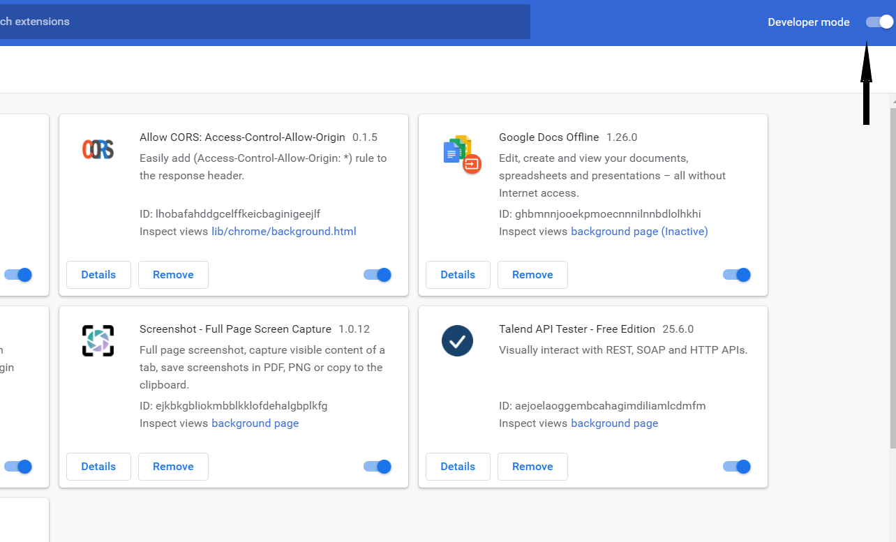
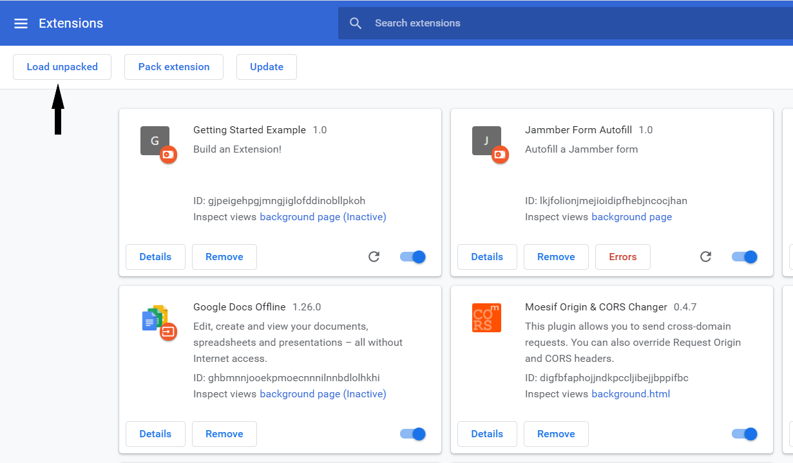
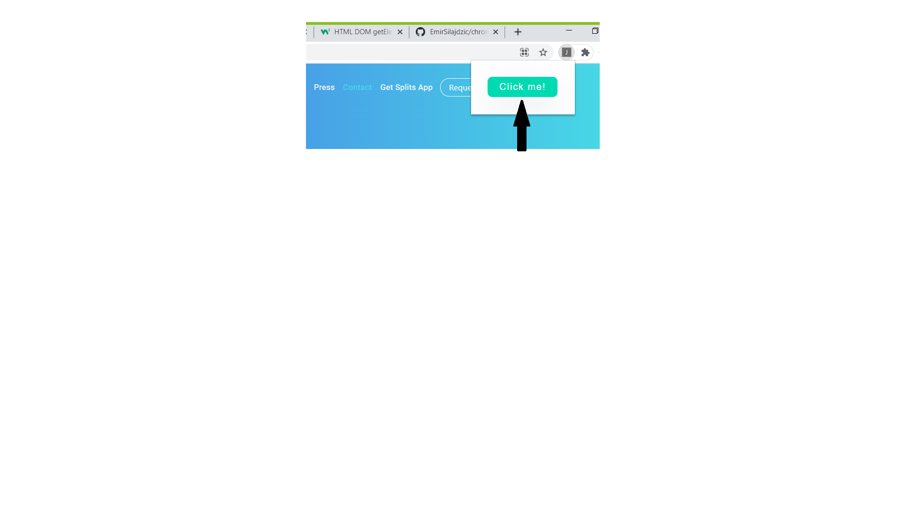

# chrome-plugin-jammber-form

1. Clone the project
2. Go to chrome://extensions/
3. Select the project folder you have cloned
4. Turn on Developer Mode
   
5. Click on "Load unpacked"
   
6. Go to the form https://web.jammber.com/contact/
7. Click on the plugin
   
8. Click on the button in the plugin
   
9. Results!!
