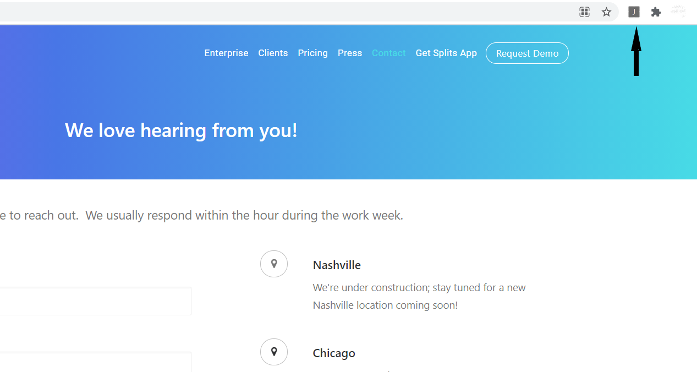

# chrome-plugin-jammber-form

1. Go to chrome://extensions/
2. Turn on Developer Mode
   
3. Click on "Load unpacked"
   
4. Go to the form https://web.jammber.com/contact/
5. Click on the plugin
   
6. Click on the button in the plugin
   
7. Results!!
